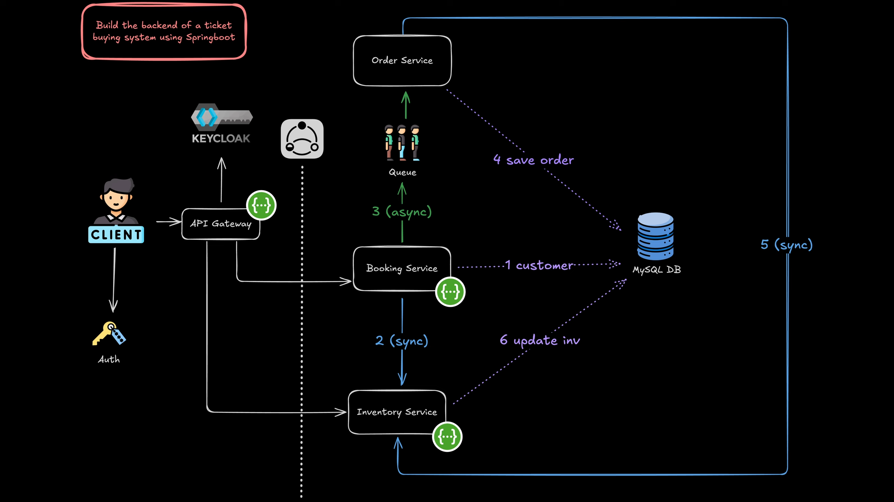

# BookQuik - Microservice Booking System

BookQuik is a robust and scalable booking service application built on a microservice architecture, designed to handle high-volume reservation operations with reliability and performance.



## Architecture Overview

BookQuik is composed of several independent microservices that communicate via Kafka event streams:

- **API Gateway**: Entry point for all client requests, handling routing, authentication, and load balancing
- **Booking Service**: Core service handling the creation, modification, and cancellation of bookings
- **Order Service**: Processes customer orders, manages order lifecycle and history
- **Inventory Service**: Manages available resources (venue, events)

## Tech Stack

- **Backend**: Java Spring Boot
- **Database**: MySQL (per service)
- **Message Broker**: Apache Kafka
- **API Gateway**: Spring Cloud Gateway
- **Configuration**: Spring Cloud Config
- **Circuit Breaker**: Resilience4j

## Getting Started

### Prerequisites

- JDK 21+
- gradle 8.0+
- Docker and Docker Compose
- MySQL 8.0+
- Kafka 3.0+

### Setup Instructions

1. Clone the repository

   ```bash
   git clone https://github.com/yourorganization/bookquik.git
   cd bookquik
   ```

2. Build the service images:

   ```bash
   python build_docker_images.py
   ```

3. Start the containers

   ```bash
   docker-compose up -d
   ```

4. Check the status:
   ```bash
   docker-compose ps
   ```

## Documentation Access

To access the Swagger UI documentation, navigate to:

```
http://localhost:8090/swagger-ui/index.html
```

## Keycloak Authentication

### Token Generation

To generate an authentication token for API testing:

- **Grant Type**: Client Credentials
- **Client Authentication**: Send as Basic Auth Header
- **Access Token URL**: http://localhost:8180/realms/bookquik/protocol/openid-connect/token
- **Client ID**: bookquick-client
- **Secret**: dGhjzX3npY40Dh8BWwLpM2PMxmIa8qxi

### Using with Postman

1. In Postman, go to the Authorization tab
2. Select OAuth 2.0 as the auth type
3. Configure the token request with the above credentials
4. Click "Get New Access Token" and then "Use Token"

### Using with cURL

```bash
curl -X POST \
  http://localhost:8180/realms/bookquik/protocol/openid-connect/token \
  -H 'Content-Type: application/x-www-form-urlencoded' \
  -d 'grant_type=client_credentials&client_id=bookquick-client&client_secret=dGhjzX3npY40Dh8BWwLpM2PMxmIa8qxi'
```

## Service Details

### API Gateway

- Routes client requests to appropriate microservices
- Handles authentication and authorization with Keycloak
- Provides load balancing across service instances
- Implements request rate limiting and circuit breaking
- Serves as a unified entry point for all client applications

### Booking Service

- Manages booking lifecycle
- Publishes events: `booking-created`, `booking-updated`, `booking-cancelled`
- Subscribes to: `inventory-updated`, `payment-processed`

### Inventory Service

- Tracks resource availability
- Publishes events: `inventory-updated`, `inventory-reserved`
- Subscribes to: `booking-created`, `booking-cancelled`, `order-created`

### Order Service

- Handles customer order processing
- Manages order lifecycle from creation to fulfillment
- Publishes events: `order-created`, `order-updated`, `order-fulfilled`, `order-cancelled`
- Subscribes to: `inventory-updated`, `payment-processed`

## Kafka Topics

- `orders`: Order-related events

## Exporting Keycloak

Run command inside keycloak container after configuration

```bash
/opt/keycloak/bin/kc.sh export --file <file>
```

## Deployment

BookQuik supports deployment to Kubernetes with Helm charts provided in the `/deployment` directory.

```
kubectl apply -f deployment/k8s/
```

## Monitoring

- Prometheus for metrics collection
- Grafana for visualization
- Distributed tracing with Spring Cloud Sleuth and Zipkin

## Contributing

Please read [CONTRIBUTING.md](CONTRIBUTING.md) for details on our code of conduct and the process for submitting pull requests.

## License

This project is licensed under the MIT License - see the [LICENSE](LICENSE) file for details.
